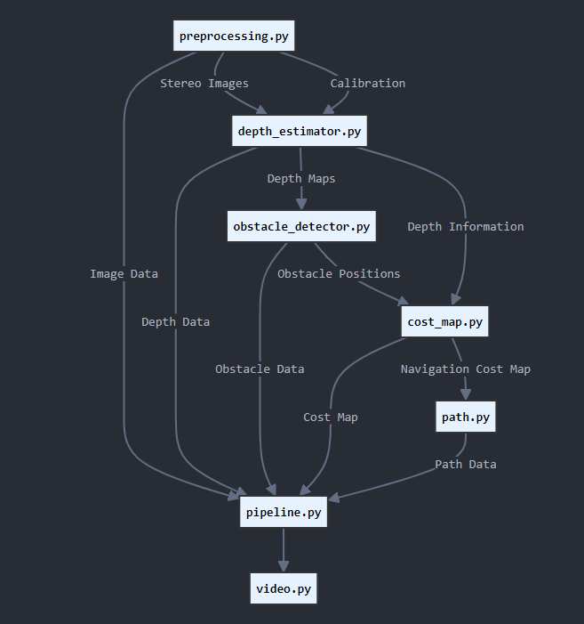

# Autonomous Vehicle Perception Pipeline using Stereo Vision

## Introduction
This project implements a comprehensive perception pipeline for autonomous vehicles using the KITTI dataset. The system utilizes stereo camera inputs to create dense depth maps, detect obstacles, and generate environmental understanding through cost maps, providing essential perception capabilities for autonomous navigation.

## Demo Video


Outputs:
- Stereo vision processing
- Dense depth estimation
- 3D obstacle detection and tracking
- Environmental mapping visualization

## Components


The system consists of six main components:

1. **Data Pipeline**
   - Handles KITTI dataset loading and preprocessing
   - Manages stereo images and calibration data

2. **Depth Estimation**
   - Generates depth maps from stereo images
   - Provides 3D scene understanding

3. **Obstacle Detection**
   - Identifies and tracks obstacles
   - Projects obstacles to 3D space

4. **Cost Map Generation**
   - Creates environmental occupancy grids
   - Integrates obstacle information

5. **Environmental Mapping**
   - Combines perception outputs
   - Builds scene understanding

6. **Integration Pipeline**
   - Synchronizes all perception components
   - Processes video sequences

## Running Individual Components

### Setup
```bash
# Clone repository
git clone https://github.com/yourusername/automated_path_planning.git

# Create virtual environment
conda create -n ENV
conda activate ENV

# Install requirements
pip install -r requirements.txt
```

### Running Components
```python
# Data Pipeline
python code/preprocessing.py

# Depth Estimation
python code/depth_estimator.py

# Obstacle Detection
python code/obstacle_detector.py

# Cost Map Generation
python code/cost_map.py

# Path Planning
python code/path.py

# Full Pipeline
python code/pipeline.py

# Video Generation
python code/video.py
```

## Acknowledgments
- [KITTI](https://www.cvlibs.net/datasets/kitti/raw_data.php) Dataset for providing autonomous driving data